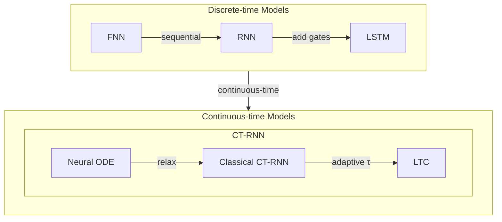

# Liquid Time-Constant Networks (LTC): What, Why, and How 

A beginner-friendly background note with key formulas.

- From FNN, RNN, LSTM, to CT-RNN
- From Neuron ODE, Classical CT-RNN, to LTC

---

## References

1. Ramin H., et al.. **Liquid Time-Constant Networks**. *AAAI*, 2021. 

2. Mathias L., et al.. **Neural Circuit Policies Enabling Auditable Autonomy**. *Nature Machine Intelligence*, 2020.

3. Ramin H., et al.. **Closed-Form Continuous-Time Neural Networks**. *Nature Machine Intelligence*, 2022. 

---

## 1. Why do we need recurrent models at all?

A standard feed-forward neural network takes an input vector and produces an output:

$$
h = \phi(Wx + b)
$$

This works well when each sample can be treated independently, such as:

- one image -> one label
- one feature vector -> one regression value

But many real-world problems are **sequential**:

- speech
- text
- sensor streams
- financial signals
- control systems

In these tasks, the current input is usually **not enough**. We also need information from the past.

That is the main motivation for **recurrent neural networks (RNNs)**.

---

## 2. Ordinary RNN: the first step toward memory

The main idea of an RNN is simple:

> Keep a hidden state that is updated step by step. This hidden state acts like the model's memory.

The classical RNN update is:

$$
h_t = \phi(W_{xh} [x_t, h_{t-1}] + b)
$$

and the output can be written as:

$$
y_t = W_y h_t + c
$$

### Meaning of the symbols

- $x_t$: input at time step $t$
- $h_{t-1}$: previous hidden state
- $h_t$: current hidden state
- $\phi$: activation function, often $\tanh$ or ReLU

### Intuition

At each time step, the RNN combines:

- the **new input** $x_t$
- the **old memory** $h_{t-1}$

and produces a **new memory** $h_t$.

So the RNN is like a rolling notebook: every new observation updates the current summary of the past.

### Strength of ordinary RNNs

- naturally handles sequences
- input length can vary
- preserves order information

### Main weakness

Ordinary RNNs often struggle with **long-term dependencies**.

Why? Because during training, gradients must travel through many time steps. This often causes:

- **vanishing gradients**
- **exploding gradients**

As a result, a plain RNN may forget information that appeared many steps earlier.

---

## 3. LSTM: a smarter memory mechanism

LSTM stands for **Long Short-Term Memory**.

Its key idea is:

> Do not overwrite memory in a single crude update. Instead, use gates to decide what to keep, what to forget, and what to write.

LSTM introduces two internal states:

- hidden state $h_t$
- cell state $c_t$

The standard equations are:

### Forget gate

$$
f_t = \sigma(W_f [h_{t-1}, x_t] + b_f)
$$

### Input gate

$$
i_t = \sigma(W_i [h_{t-1}, x_t] + b_i)
$$

### Candidate memory

$$
\tilde{c}_t = \tanh(W_c [h_{t-1}, x_t] + b_c)
$$

### Cell-state update

$$
c_t = f_t \odot c_{t-1} + i_t \odot \tilde{c}_t
$$

### Output gate

$$
o_t = \sigma(W_o [h_{t-1}, x_t] + b_o)
$$

### Hidden-state update

$$
h_t = o_t \odot \tanh(c_t)
$$

### Why LSTM works better than plain RNN

The key equation is:

$$
c_t = f_t \odot c_{t-1} + i_t \odot \tilde{c}_t
$$

This creates a more stable path for memory.

- If $f_t \approx 1$, the old memory is mostly kept.
- If $i_t \approx 0$, little new information is written.

So LSTM can preserve important information over longer time spans.

### Intuition

A plain RNN says:

> "I update my memory every step."

An LSTM says:

> "Before I update my memory, I first decide what to forget and what to keep."

That is why LSTM is much better at long-range temporal dependencies.

---

## 4. GRU in one sentence

GRU is a simpler gated recurrent model with a similar spirit:

> Use gates to control memory flow, but with a lighter structure than LSTM.

You do not need GRU details to understand the path toward continuous-time models, but it is useful to remember that:

- plain RNN -> weak memory management
- LSTM/GRU -> gated memory management

This "gating" idea becomes very important later.

---

## 5. Why move from discrete-time RNNs to continuous-time RNNs?

Ordinary RNNs and LSTMs update their states in discrete steps:

$$
h_t = F(h_{t-1}, x_t)
$$

This assumes that time progresses in a sequence of separate ticks:

- step 1
- step 2
- step 3

That is fine in many applications, but not always natural.

### Problems with purely discrete-time thinking

In many real systems:

- observations may arrive at **irregular time intervals**
- the underlying process evolves **continuously in time**
- physics, biology, and control systems are better described by **differential equations**

So researchers began asking:

> Can hidden states evolve continuously, instead of jumping only at discrete time steps?

This leads to **continuous-time recurrent neural networks (CT-RNNs)**.

---

## 6. CT-RNN: hidden states evolve continuously

Instead of a discrete hidden state $h_t$, we now use a continuous-time state $h(t)$.

The model is no longer written as a step-to-step update. Instead, it is described by a differential equation:

$$
\frac{dh(t)}{dt} = F(h(t), x(t), t)
$$

Here:

- $h(t)$ is the hidden state at continuous time $t$
- $x(t)$ is the input signal
- $\frac{dh}{dt}$ tells us how the state changes at this moment

This kind of form is theoretically meaningful but not practical for specific training.

### Why CT-RNNs matter

They are useful because they:

- model irregular time naturally
- fit physical and biological systems better
- connect neural networks with dynamical systems theory

---
## 7. Three following models for CT-RNN

To specify the CT-RNN formula for training, there are three typical models. 

### Neural ODE: an even more general continuous-time view

A **Neural ODE** is the most direct continuous-time formulation:

$$
\frac{dh(t)}{dt} = f(h(t), t, \theta)
$$

Sometimes external input is included explicitly, for example:

$$
\frac{dh(t)}{dt} = f(h(t), I(t), t, \theta)
$$

#### Key idea

Instead of defining the next hidden state directly, the network defines the **instantaneous derivative**.

In other words, the model says:

> "I will not tell you the next state directly. I will tell you how the current state should change right now."

#### Why Neural ODE was exciting

It can be viewed as the continuous-depth limit of a ResNet.

A residual block looks like:

$$
h_{k+1} = h_k + f(h_k, \theta_k)
$$

If we write a small step size $\Delta t$ explicitly:

$$
h_{k+1} = h_k + \Delta t\, f(h_k, \theta)
$$

This is exactly the form of an Euler discretization of an ODE. In the continuous limit, we get:

$$
\frac{dh(t)}{dt} = f(h(t), t, \theta)
$$

#### Strengths of Neural ODEs

- elegant continuous-time formulation
- natural connection to dynamical systems
- flexible numerical solvers can be used
- adaptive computation is possible

#### Main limitation

Neural ODEs are very flexible, but also very **black-box**:

- the derivative is directly produced by a neural network
- the dynamics may be hard to interpret
- numerical behavior depends strongly on the solver

This motivates more structured continuous-time models.

---

### A classical CT-RNN form

A very common form is:

$$
\frac{dh(t)}{dt} = -\frac{h(t)}{\tau} + f(h(t), x(t), t, \theta)
$$

#### What does this mean?

This equation has two parts.

##### 1. Leakage / decay term

$$
-\frac{h(t)}{\tau}
$$

If nothing drives the system, the state decays toward equilibrium.

##### 2. Driving term

$$
f(h(t), x(t), t, \theta)
$$

This is the nonlinear input-dependent force pushing the state.

#### Intuition

You can imagine each hidden unit as a small physical system:

- it naturally relaxes over time
- but inputs and recurrent interactions push it around

This is already much closer to physics and biological neural dynamics than a purely discrete RNN.

---

### From Neural ODE and Classical CT-RNN to LTC

At this point, the main question becomes:

> Can we keep the advantages of continuous-time modeling, but introduce more structure, more stability, and richer dynamics?

This is where **Liquid Time-Constant Networks (LTCs)** come in.

---

### LTC: the key idea behind liquid neural networks

The central idea of LTC is:

> Do not let the neural network only control the derivative. Let it also control the system's effective time scale.

A key LTC form is:

$$
\frac{dx(t)}{dt} = -\left(\frac{1}{\tau} + f(x(t), I(t), t, \theta)\right)x(t) + f(x(t), I(t), t, \theta) A
$$

This can be understood as a structured dynamical system.

### Compare three models again

#### Neural ODE

$$
\dot{x} = f(x, I, t, \theta)
$$

The network directly defines the derivative.

#### Classical CT-RNN

$$
\dot{x} = -\frac{x}{\tau} + f(x, I, t, \theta)
$$

There is a fixed decay term plus a nonlinear driving term.

#### LTC

$$
\dot{x} = -\left(\frac{1}{\tau}+f(x,I,t,\theta)\right)x + f(x,I,t,\theta)A
$$

Now the nonlinear term also changes the **effective time constant**.

---

### Why is it called "liquid"?

Because the effective time constant is no longer fixed. It changes with the state and input.

The paper gives the effective time constant as:

$$
\tau_{\text{sys}} = \frac{\tau}{1 + \tau f(x(t), I(t), t, \theta)}
$$

So the response speed of the system becomes dynamic:

- sometimes fast
- sometimes slow
- depending on the current context

#### Intuition

A classical CT-RNN says:

> "Each unit has a fixed natural time scale."

An LTC says:

> "Each unit can adapt its own time scale depending on the current situation."

That is why LTC is more expressive and often more suitable for complex time-varying patterns.

---

## 10. The deep connection between LSTM-style gating and LTC

There is an important conceptual bridge here.

### In LSTM

Gates control **memory content**:

- what to forget
- what to write
- what to expose

### In LTC

The nonlinear mechanism controls **dynamical behavior itself**:

- how fast the system reacts
- how strongly the state is pulled
- how the effective time constant changes

So, at a high level, the path looks like this:

- **RNN**: add memory
- **LSTM**: manage memory with gates
- **CT-RNN**: make state evolution continuous in time
- **Neural ODE**: learn a continuous dynamical law directly
- **LTC**: make even the system time scale adaptive

That is why LTC can be viewed as a deeper fusion of:

- recurrent memory
- gating
- continuous-time dynamics

---

## 11. The whole development path in one sentence per model

### RNN

A simple recurrent state update:

$$
h_t = \phi(W_x x_t + W_h h_{t-1} + b)
$$

**Idea:** keep a memory of the past.

### LSTM

A gated recurrent architecture with a more stable memory path:

$$
c_t = f_t \odot c_{t-1} + i_t \odot \tilde{c}_t
$$

**Idea:** decide what to keep, forget, and write.

### CT-RNN

A continuous-time recurrent system:

$$
\frac{dx(t)}{dt} = -\frac{x(t)}{\tau} + f(x(t), I(t), t, \theta)
$$

**Idea:** let hidden states evolve continuously.

### Neural ODE

A general continuous-depth or continuous-time model:

$$
\frac{dh(t)}{dt} = f(h(t), t, \theta)
$$

**Idea:** directly learn the derivative field.

### LTC

A structured continuous-time model with adaptive time constants:

$$
\frac{dx(t)}{dt} = -\left(\frac{1}{\tau} + f(x(t), I(t), t, \theta)\right)x(t) + f(x(t), I(t), t, \theta) A
$$

**Idea:** let the system's own time scale become dynamic.

---

## 12. A compact comparison table

| Model | Time view | Memory mechanism | Key strength | Main limitation |
|---|---|---|---|---|
| RNN | Discrete | Hidden state $h_t$ | Simple sequence modeling | Weak long-term memory |
| LSTM | Discrete | Gated hidden/cell states | Better long-range memory | More complex than plain RNN |
| CT-RNN | Continuous | Continuous hidden dynamics | Natural for irregular time and dynamics | Fixed time constants may be limiting |
| Neural ODE | Continuous | Learned derivative field | Elegant and flexible | Can be too black-box |
| LTC | Continuous | Adaptive time-constant dynamics | Rich, structured, time-adaptive dynamics | More solver- and implementation-sensitive |

---

## 13. Formula evolution chart

| Model | Key idea |
|------|----------|
| RNN | Basic discrete-time recurrent update with short-term memory. |
| LSTM | Adds gates to decide what to keep, forget, and write. |
| CT-RNN | Moves from discrete recurrence to continuous-time dynamics. |
| Neural ODE | Learns the derivative directly with a neural network. |
| LTC | Makes the effective time constant adaptive and input-dependent. |

---

## 14. Final takeaway

The historical logic in each evolution stage tries to fix a real limitation of the previous one.

- **RNN** adds memory to neural networks.
- **LSTM** makes memory management more reliable.
- **CT-RNN** makes hidden-state evolution continuous in time.
- **Neural ODE** turns hidden-state evolution into a learned differential equation.
- **LTC** makes even the system's own response speed adaptive.

So the big story is:

> from sequence memory, to gated memory, to continuous-time dynamics, to adaptive continuous-time dynamics.

